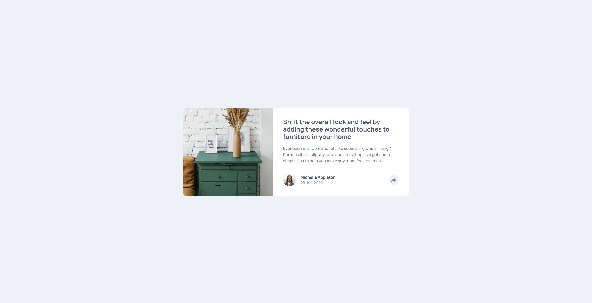

# Frontend Mentor - Article preview component solution

This is a solution to the [Article preview component challenge on Frontend Mentor](https://www.frontendmentor.io/challenges/article-preview-component-dYBN_pYFT). Frontend Mentor challenges help you improve your coding skills by building realistic projects.

## Table of contents

-   [Overview](#overview)
    -   [The challenge](#the-challenge)
    -   [Screenshot](#screenshot)
    -   [Links](#links)
-   [My process](#my-process)
    -   [Built with](#built-with)
    -   [What I learned](#what-i-learned)
    -   [Continued development](#continued-development)
    -   [Useful resources](#useful-resources)
-   [Author](#author)
-   [Acknowledgments](#acknowledgments)

**Note: Delete this note and update the table of contents based on what sections you keep.**

## Overview

### The challenge

Users should be able to:

-   View the optimal layout for the component depending on their device's screen size
-   See the social media share links when they click the share icon

### Screenshot



### Links

-   Solution URL: [Add solution URL here](https://github.com/Arnotts33/Frontend-Mentor-Challenges/tree/main/article-preview-component-master)
-   Live Site URL: [Add live site URL here](https://arnotts33.github.io/Frontend-Mentor-Challenges/article-preview-component-master/)

## My process

### Built with

-   Semantic HTML5 markup
-   CSS custom properties
-   Flexbox
-   CSS Grid
-   Mobile-first workflow
-   [Javascript]

**Note: These are just examples. Delete this note and replace the list above with your own choices**

### What I learned

Use this section to recap over some of your major learnings while working through this project. Writing these out and providing code samples of areas you want to highlight is a great way to reinforce your own knowledge.

To see how you can add code snippets, see below:

```html
Structured with semantic HTML and finding class or id names to work with JS
```

```css
Worked with flex grid and managed to get good responsiveness layouts
Proud of my floating "share" bar
```

```js
Happy to get it working on toggle.
```

### Continued development

HTML / CSS: More work on good class and id names

JS: More work and learning needed on JS to make it work with a shorter and more efficient code.

### Useful resources

## Author

-   Frontend Mentor - [@yourusername](https://www.frontendmentor.io/profile/Arnotts33)
