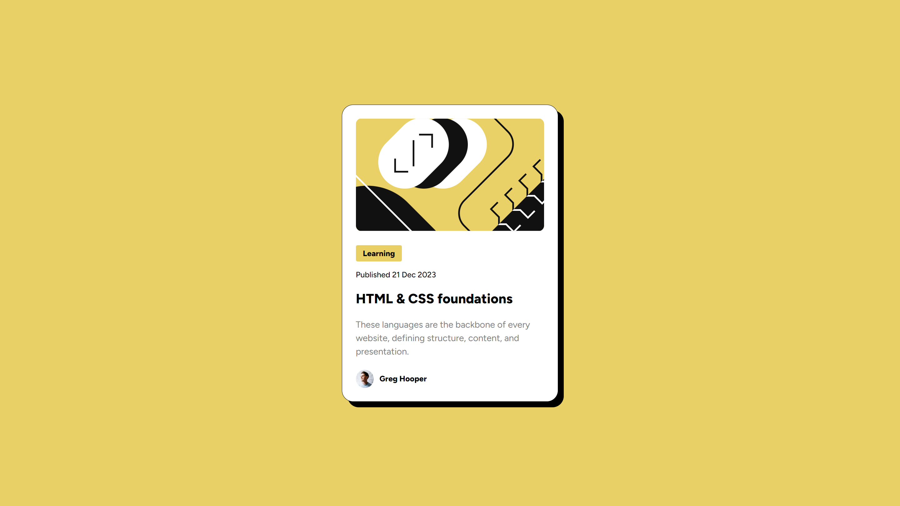

# Frontend Mentor - Blog preview card solution

This is a solution to the [Blog preview card challenge on Frontend Mentor](https://www.frontendmentor.io/challenges/blog-preview-card-ckPaj01IcS). Frontend Mentor challenges help you improve your coding skills by building realistic projects.

## Table of contents

-   [Overview](#overview)
    -   [The challenge](#the-challenge)
    -   [Screenshot](#screenshot)
    -   [Links](#links)
-   [My process](#my-process)
    -   [Built with](#built-with)
    -   [What I learned](#what-i-learned)
    -   [Continued development](#continued-development)
    -   [Useful resources](#useful-resources)
-   [Author](#author)
-   [Acknowledgments](#acknowledgments)

**Note: Delete this note and update the table of contents based on what sections you keep.**

## Overview

### The challenge

Users should be able to:

-   See hover and focus states for all interactive elements on the page

### Screenshot



### Links

-   Solution URL: [Add solution URL here](https://github.com/Arnotts33/blog-preview-card)
-   Live Site URL: [Add live site URL here](https://arnotts33.github.io/blog-preview-card/)

## My process

### Built with

-   Semantic HTML5 markup
-   CSS custom properties
-   Flexbox

### What I learned

Use this section to recap over some of your major learnings while working through this project. Writing these out and providing code samples of areas you want to highlight is a great way to reinforce your own knowledge.

To see how you can add code snippets, see below:

```html
Nothing special here on this challenge
```

```css
.tried-to-use-clamp {
	font-size: clamp(12px, 1.1vw, 14px);
}

First time using this css property. The challenge asked for a responsive font-size without using media queries. Found this property to be the most suitable after doing some research. Still trying to understand how it works.
```

### Continued development

I am going to work more on responsiveness with media queries and properties like clamp.

I will also dive a bit more into Figma to understand how to better use it and get the most out of the figma files.

### Useful resources

-   [Example resource 1](https://www.swebdev.fr/blog/la-fonction-css-clamp) - This helped me for the clamp property.Sorry it is in french 🥐.

## Author

-   Website - [Add your name here](https://www.your-site.com)
-   Frontend Mentor - [@yourusername](https://www.frontendmentor.io/profile/Arnotts33)

## Acknowledgments
