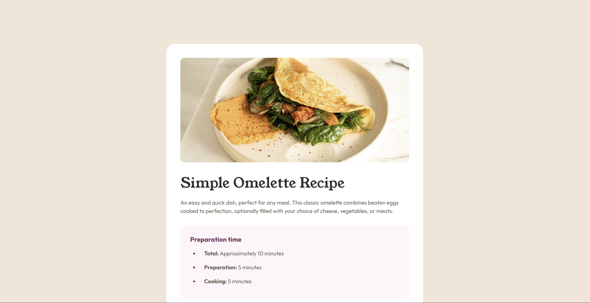

This is a solution to the [Recipe page challenge on Frontend Mentor](https://www.frontendmentor.io/challenges/recipe-page-KiTsR8QQKm). Frontend Mentor challenges help you improve your coding skills by building realistic projects.

## Table of contents

-   [Overview](#overview)
    -   [The challenge](#the-challenge)
    -   [Screenshot](#screenshot)
    -   [Links](#links)
-   [My process](#my-process)
    -   [Built with](#built-with)
    -   [What I learned](#what-i-learned)
    -   [Continued development](#continued-development)
    -   [Useful resources](#useful-resources)
-   [Author](#author)
-   [Acknowledgments](#acknowledgments)

**Note: Delete this note and update the table of contents based on what sections you keep.**

## Overview

### Screenshot



### Links

-   Solution URL: [Add solution URL here](https://github.com/Arnotts33/Frontend-Mentor-Challenges/tree/main/recipe-page-main)
-   Live Site URL: [Add live site URL here](https://arnotts33.github.io/Frontend-Mentor-Challenges/recipe-page-main/)

## My process

### Built with

-   Semantic HTML5 markup
-   CSS custom properties
-   Flexbox

### What I learned

Use this section to recap over some of your major learnings while working through this project. Writing these out and providing code samples of areas you want to highlight is a great way to reinforce your own knowledge.

To see how you can add code snippets, see below:

```html
Use of table and semantic html
```

```css
    Styling the table and the lists was quite challenging

```

### Continued development

I think I lost quite some time to try to be as close as possible to the design. I will try to split my css in different files.

### Useful resources

## Author

-   Website - [Add your name here](https://arnotts33.github.io/)
-   Frontend Mentor - [@yourusername](https://www.frontendmentor.io/profile/Arnotts33)

## Acknowledgments
