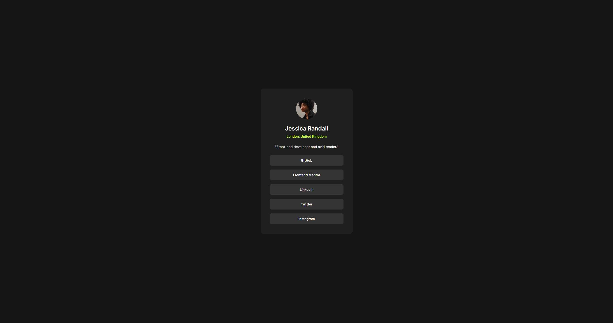

# Frontend Mentor - Social links profile solution

This is a solution to the [Social links profile challenge on Frontend Mentor](https://www.frontendmentor.io/challenges/social-links-profile-UG32l9m6dQ). Frontend Mentor challenges help you improve your coding skills by building realistic projects.

## Table of contents

-   [Overview](#overview)
    -   [The challenge](#the-challenge)
    -   [Screenshot](#screenshot)
    -   [Links](#links)
-   [My process](#my-process)
    -   [Built with](#built-with)
    -   [What I learned](#what-i-learned)
    -   [Continued development](#continued-development)
    -   [Useful resources](#useful-resources)
-   [Author](#author)
-   [Acknowledgments](#acknowledgments)

**Note: Delete this note and update the table of contents based on what sections you keep.**

## Overview

### The challenge

Users should be able to:

-   See hover and focus states for all interactive elements on the page

### Screenshot



### Links

-   Solution URL: [Add solution URL here](https://github.com/Arnotts33/Frontend-Mentor-Challenges/tree/main/social-links-profile-main)
-   Live Site URL: [Add live site URL here](https://arnotts33.github.io/Frontend-Mentor-Challenges/social-links-profile-main/)

## My process

### Built with

-   Semantic HTML5 markup
-   CSS custom properties
-   Flexbox

### What I learned

Use this section to recap over some of your major learnings while working through this project. Writing these out and providing code samples of areas you want to highlight is a great way to reinforce your own knowledge.

To see how you can add code snippets, see below:

```html
First time trying to use semantic html. Makes the code much clearer.
```

```css
I used :root and @font-face for the first time

```

### Continued development

I am going to work more on responsiveness with media queries and properties like clamp.

I will also dive a bit more into Figma to understand how to better use it and get the most out of the figma files.

### Useful resources

## Author

-   Website - [Add your name here](https://arnotts33.github.io/)
-   Frontend Mentor - [@yourusername](https://www.frontendmentor.io/profile/Arnotts33)

## Acknowledgments
