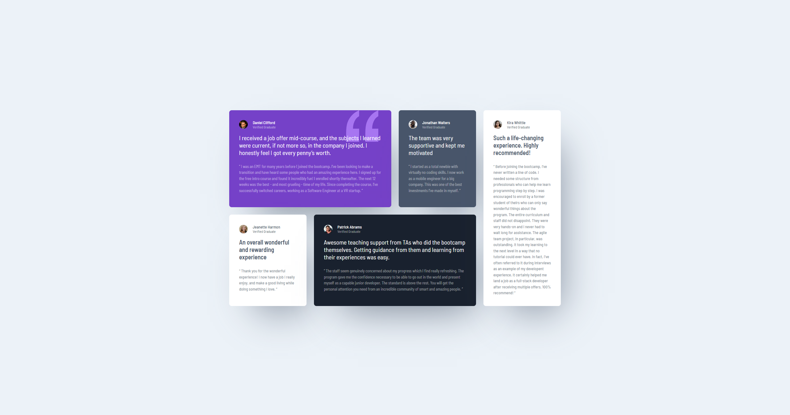

# Frontend Mentor - Testimonials grid section solution

This is a solution to the [Testimonials grid section challenge on Frontend Mentor](https://www.frontendmentor.io/challenges/testimonials-grid-section-Nnw6J7Un7). Frontend Mentor challenges help you improve your coding skills by building realistic projects.

## Table of contents

-   [Overview](#overview)
    -   [The challenge](#the-challenge)
    -   [Screenshot](#screenshot)
    -   [Links](#links)
-   [My process](#my-process)
    -   [Built with](#built-with)
    -   [What I learned](#what-i-learned)
    -   [Continued development](#continued-development)
    -   [Useful resources](#useful-resources)
-   [Author](#author)
-   [Acknowledgments](#acknowledgments)

**Note: Delete this note and update the table of contents based on what sections you keep.**

## Overview

### The challenge

Users should be able to:

-   View the optimal layout for the site depending on their device's screen size

### Screenshot



### Links

-   Solution URL: [Add solution URL here](https://github.com/Arnotts33/Frontend-Mentor-Challenges/tree/main/testimonials-grid-section-main)
-   Live Site URL: [Add live site URL here](https://arnotts33.github.io/Frontend-Mentor-Challenges/testimonials-grid-section-main/)

## My process

### Built with

-   Semantic HTML5 markup
-   CSS custom properties
-   Flexbox
-   CSS Grid
-   Mobile-first workflow

### What I learned

Learned a lot about CSS Grid and will definitely use it more.

```css
CSS Grid
```

### Continued development

I will deepen my understanding and practice of CSS Grid.

### Useful resources

-   Kevin Powell YouTube channel and articles

## Author

-   Frontend Mentor - [@Arnotts33](https://www.frontendmentor.io/profile/Arnotts33)
